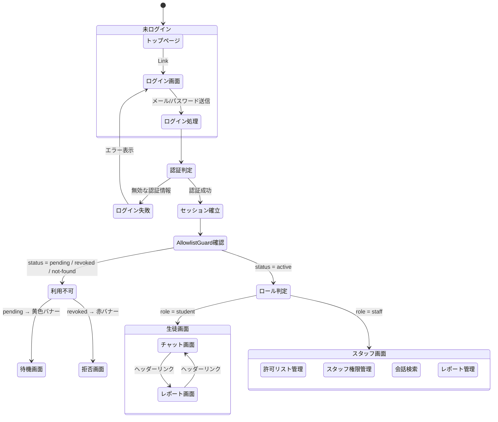

/** @file 画面遷移図 — Marubo AI システム */

# 画面遷移図（Screen Transitions）

## 概要

Marubo AI は Next.js 14 App Router を使用した塾向け AI チャットボットです。
ユーザーの認証状態（未ログイン / ログイン済み）とロール（生徒 / スタッフ）に応じて
アクセス可能な画面が分岐します。

---

## 全体画面遷移図

```mermaid
flowchart TD
    subgraph PUBLIC["公開エリア（認証不要）"]
        HOME["/ トップページ\n（ランディング）"]
        LOGIN["/login ログイン画面\n（メール/パスワード + 新規登録）"]
        RESET_PW["/reset-password\nパスワードリセット"]
        CSV_MANUAL["/manual/csv_import\nCSVインポート手順書"]
        CHAT_TEST["/chat-test\nチャットテスト画面\n（本番ではブロック）"]
    end

    subgraph STUDENT["生徒エリア（AllowlistGuard: active 必須）"]
        CHAT["/chat チャット画面\n（AI対話 + 会話履歴）"]
        REPORTS["/reports 学習レポート\n（月次レポート閲覧）"]
    end

    subgraph STAFF["スタッフエリア（requireStaff 必須）"]
        ADMIN_DASH["/admin ダッシュボード\n（4カードリンク）"]
        ALLOWLIST["/admin/allowlist\n許可リスト管理"]
        GRANT["/admin/grant\nスタッフ権限管理\n（GRANT_ALLOWED_EMAILS 限定）"]
        ADMIN_CONV["/admin/conversations\n会話検索・閲覧"]
        ADMIN_REPORTS["/admin/reports\nレポート生成・管理"]
    end

    subgraph MODALS["モーダル・サブビュー"]
        LIGHTBOX["ImageLightbox\n（画像拡大表示）"]
        CONFIRM_DLG["ConfirmDialog\n（React 確認ダイアログ）"]
        SESSION_MODAL["SessionExpiredModal\n（セッション失効通知）"]
        OFFLINE_BANNER["OfflineBanner\n（オフライン通知）"]
        CONV_DETAIL["ConversationDetail\n（会話詳細パネル）"]
        SIDEBAR["ConversationSidebar\n（会話履歴サイドバー\n+ モバイルドロワー）"]
        PREVIEW_BAR["ImagePreviewBar\n（添付プレビュー）"]
    end

    %% 公開エリア内の遷移
    HOME -->|"Link: /login"| LOGIN
    LOGIN -->|"パスワード忘れ"| RESET_PW

    %% ログイン後の遷移（ロール別ルーティング GFX-01）
    LOGIN -->|"ログイン成功\nrole=staff"| ADMIN_DASH
    LOGIN -->|"ログイン成功\nrole=student\nstatus=active"| CHAT
    LOGIN -->|"新規登録\n確認メール送信"| LOGIN

    %% 管理ダッシュボードからの遷移
    ADMIN_DASH -->|"カードリンク"| ALLOWLIST
    ADMIN_DASH -->|"カードリンク"| GRANT
    ADMIN_DASH -->|"カードリンク"| ADMIN_CONV
    ADMIN_DASH -->|"カードリンク"| ADMIN_REPORTS

    %% 生徒エリアへの遷移
    CHAT -->|"ヘッダーLink"| REPORTS
    CHAT -->|"ヘッダーLink: /"| HOME
    REPORTS -->|"ヘッダーLink"| CHAT
    REPORTS -->|"ログアウト"| LOGIN

    %% スタッフエリアへの遷移
    ALLOWLIST -->|"フッターLink: /"| HOME
    ALLOWLIST -->|"Link"| CSV_MANUAL
    CSV_MANUAL -->|"Link"| ALLOWLIST
    GRANT -->|"フッターLink: /"| HOME
    ADMIN_CONV -->|"フッターLink: /"| HOME
    ADMIN_REPORTS -->|"フッターLink: /"| HOME

    %% モーダル・サブビューの関係
    CHAT ---|"内包"| SIDEBAR
    CHAT ---|"内包"| PREVIEW_BAR
    CHAT -->|"サムネイルクリック"| LIGHTBOX
    ADMIN_CONV -->|"行クリック"| CONV_DETAIL

    %% Middleware 認証ガード（GFX-02）
    CHAT -.->|"middleware.ts\n未認証"| LOGIN
    REPORTS -.->|"middleware.ts\n未認証"| LOGIN
    ADMIN_DASH -.->|"middleware.ts\n未認証"| LOGIN

    %% AllowlistGuard（二重チェック）
    CHAT -.->|"AllowlistGuard\nstatus != active"| HOME
    REPORTS -.->|"AllowlistGuard\nstatus != active"| HOME

    %% スタイリング
    classDef publicPage fill:#e8f5e9,stroke:#4caf50,stroke-width:2px
    classDef studentPage fill:#e3f2fd,stroke:#2196f3,stroke-width:2px
    classDef staffPage fill:#fff3e0,stroke:#ff9800,stroke-width:2px
    classDef modal fill:#f3e5f5,stroke:#9c27b0,stroke-width:1px,stroke-dasharray:5

    class HOME,LOGIN,RESET_PW,CSV_MANUAL,CHAT_TEST publicPage
    class CHAT,REPORTS studentPage
    class ADMIN_DASH,ALLOWLIST,GRANT,ADMIN_CONV,ADMIN_REPORTS staffPage
    class LIGHTBOX,CONFIRM_DLG,SESSION_MODAL,OFFLINE_BANNER,CONV_DETAIL,SIDEBAR,PREVIEW_BAR modal
```

---

## 認証・認可フロー

---

## 画面一覧

| # | パス | 画面名 | 認証 | ロール | 主な機能 |
|---|------|--------|------|--------|----------|
| 1 | `/` | トップページ | 不要 | - | ランディング、ログインへのリンク |
| 2 | `/login` | ログイン画面 | 不要 | - | メール/パスワード認証、新規登録、パスワードリセットリンク |
| 3 | `/reset-password` | パスワードリセット | 不要 | - | リセットメール送信 + `PASSWORD_RECOVERY` イベントでパスワード更新（GFX-12） |
| 4 | `/chat` | チャット画面 | 必要（Middleware） | active生徒+ | AI対話、会話履歴、画像添付、会話削除、利用状況表示、モバイルドロワー |
| 5 | `/reports` | 学習レポート | 必要（Middleware） | active生徒+ | 月次レポート閲覧 |
| 6 | `/admin` | 管理ダッシュボード | 必要（Middleware） | staff | 4カードリンク（許可リスト/権限管理/会話検索/レポート管理）（GFX-11） |
| 7 | `/admin/allowlist` | 許可リスト管理 | 必要 | staff | メール許可リスト CRUD + CSV一括登録 |
| 8 | `/admin/grant` | スタッフ権限管理 | 必要 | staff (特権) | スタッフ権限の付与/解除 + 監査ログ |
| 9 | `/admin/conversations` | 会話検索 | 必要 | staff | 全ユーザーの会話検索・詳細閲覧（N+1最適化済み、添付画像表示） |
| 10 | `/admin/reports` | レポート管理 | 必要 | staff | 月次レポート生成・CSV出力 |
| 11 | `/chat-test` | チャットテスト | 不要 | - | 開発用テスト画面（本番ではMiddlewareでブロック GFX-02） |
| 12 | `/manual/csv_import` | CSV手順書 | 不要 | - | CSVインポート方法のドキュメント |

---

## モーダル・サブビュー一覧

| コンポーネント | 表示場所 | トリガー | 閉じ方 |
|----------------|----------|----------|--------|
| ImageLightbox | チャット画面 + 会話詳細 | サムネイルクリック | Escape / 背景クリック / ✕ボタン |
| ConversationSidebar | チャット画面 | デスクトップ: 常時表示。モバイル: ハンバーガーメニューでドロワー表示（GFX-07） | モバイル: 背景タップ / 会話選択後自動クローズ |
| ImagePreviewBar | チャット画面 | ファイル選択後 | 各画像の✕ボタン |
| ConversationDetail | 会話検索画面 | テーブル行クリック | ✕ボタン |
| ConfirmDialog | 管理系各画面 | 破壊的操作ボタン（削除、ステータス変更等） | キャンセル / 確認ボタン（GFX-09） |
| SessionExpiredModal | 全画面 | `onAuthStateChange` の `SIGNED_OUT` イベント | 再ログインボタン（GFX-05） |
| OfflineBanner | 全画面（上部固定） | `navigator.onLine` = false | オンライン復帰時に自動消去（GFX-06） |

---

## アクセス制御マトリクス

| 画面 | 未ログイン | pending生徒 | active生徒 | スタッフ | 特権スタッフ |
|------|-----------|------------|-----------|---------|------------|
| `/` | ○ | ○ | ○ | ○ | ○ |
| `/login` | ○ | ○ | ○ | ○ | ○ |
| `/chat` | × → `/` | △ 待機画面 | ○ | ○ | ○ |
| `/reports` | × → `/` | △ 待機画面 | ○ | ○ | ○ |
| `/admin/allowlist` | × → 401 | × → 403 | × → 403 | ○ | ○ |
| `/admin/grant` | × → 401 | × → 403 | × → 403 | × → 403 | ○ |
| `/admin/conversations` | × → 401 | × → 403 | × → 403 | ○ | ○ |
| `/admin/reports` | × → 401 | × → 403 | × → 403 | ○ | ○ |

凡例: ○=アクセス可、△=制限付き表示、×=リダイレクト/エラー
