/** @file シーケンス図 — Marubo AI 主要ユースケース */

# シーケンス図（Sequence Diagrams）

## 概要

Marubo AI の主要ユースケースについて、正常系・異常系の処理フローを記述します。

---

## 1. ユーザー認証フロー（ログイン〜セッション確立）

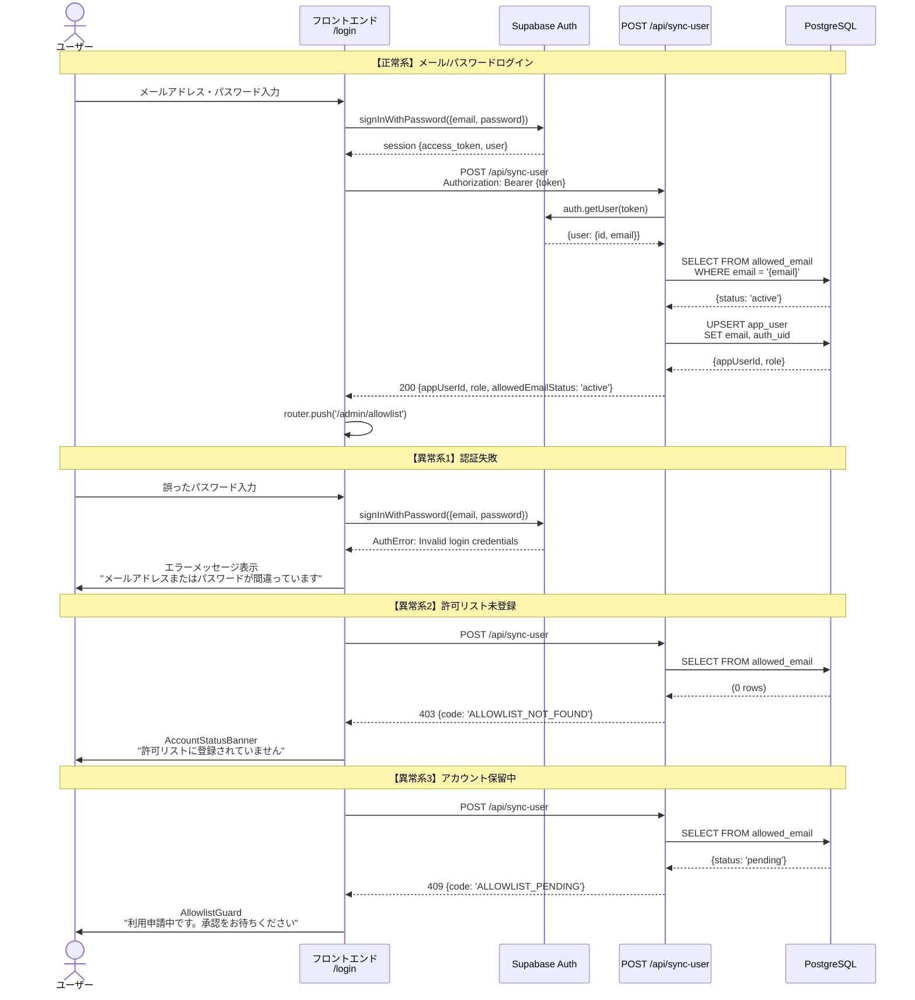

---

## 2. 新規ユーザー登録フロー

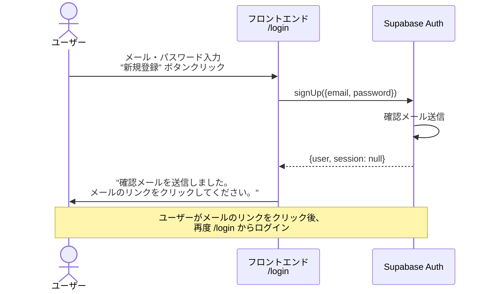

---

## 3. AI チャット送信フロー（画像添付あり）

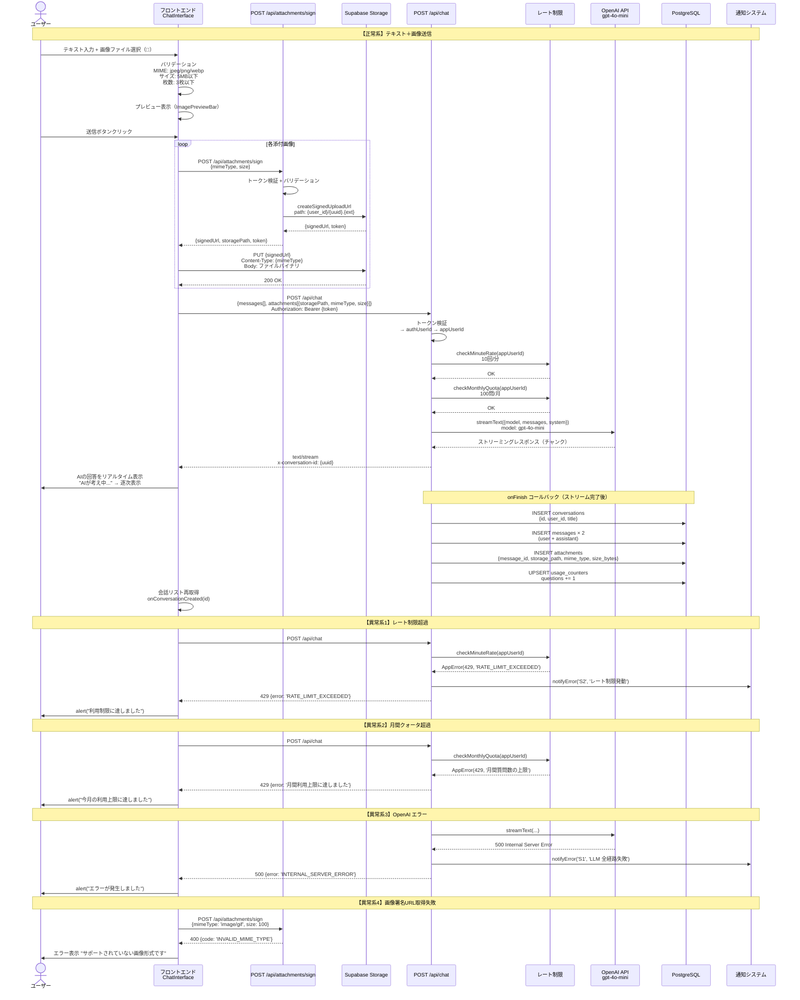

---

## 4. 会話履歴の閲覧フロー

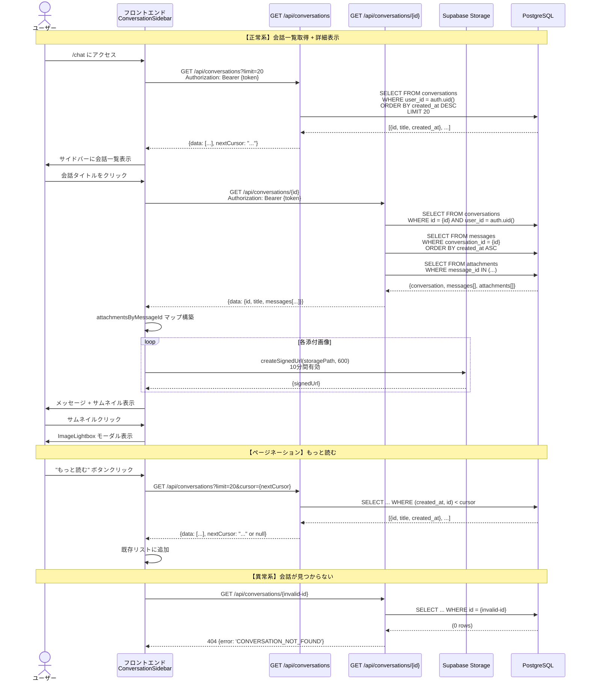

---

## 5. 許可リスト管理フロー（スタッフ操作）

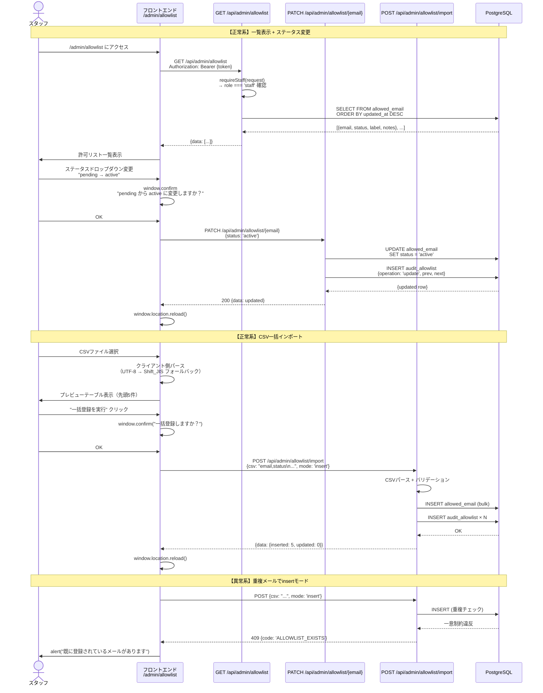

---

## 6. スタッフ権限管理フロー

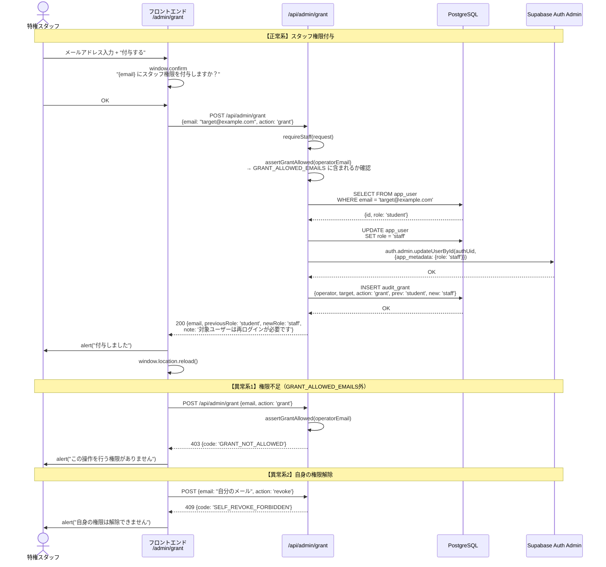

---

## 7. 月次レポート生成フロー（スタッフ手動 / Cron）

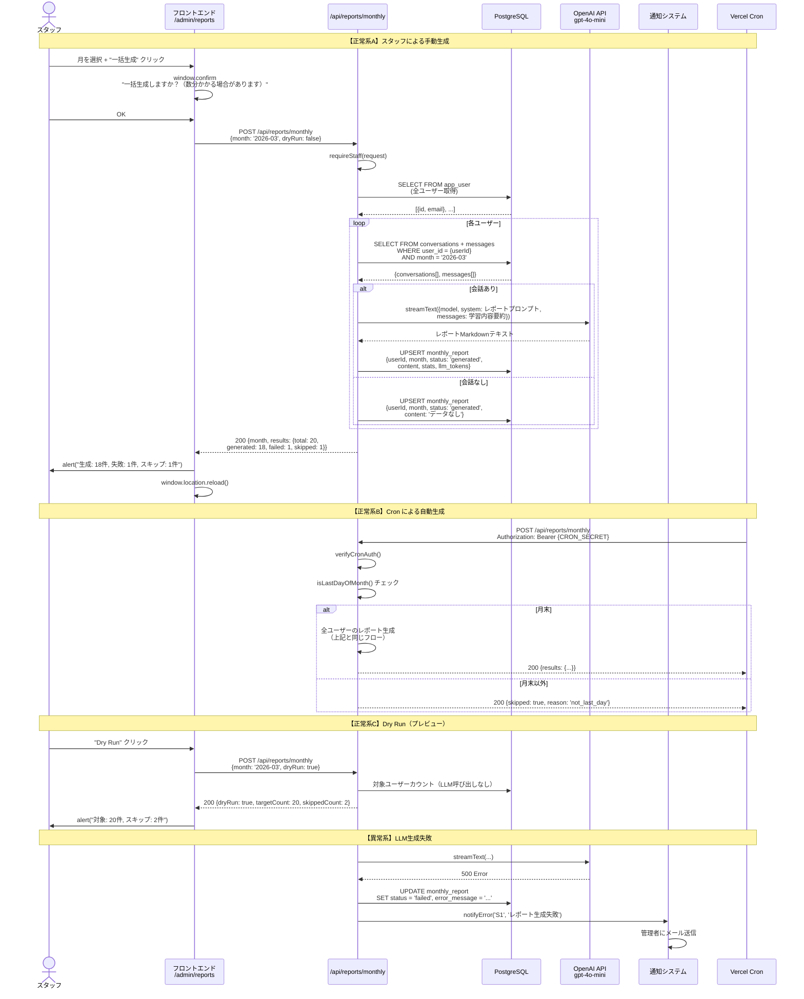

---

## 8. 生徒のレポート閲覧フロー

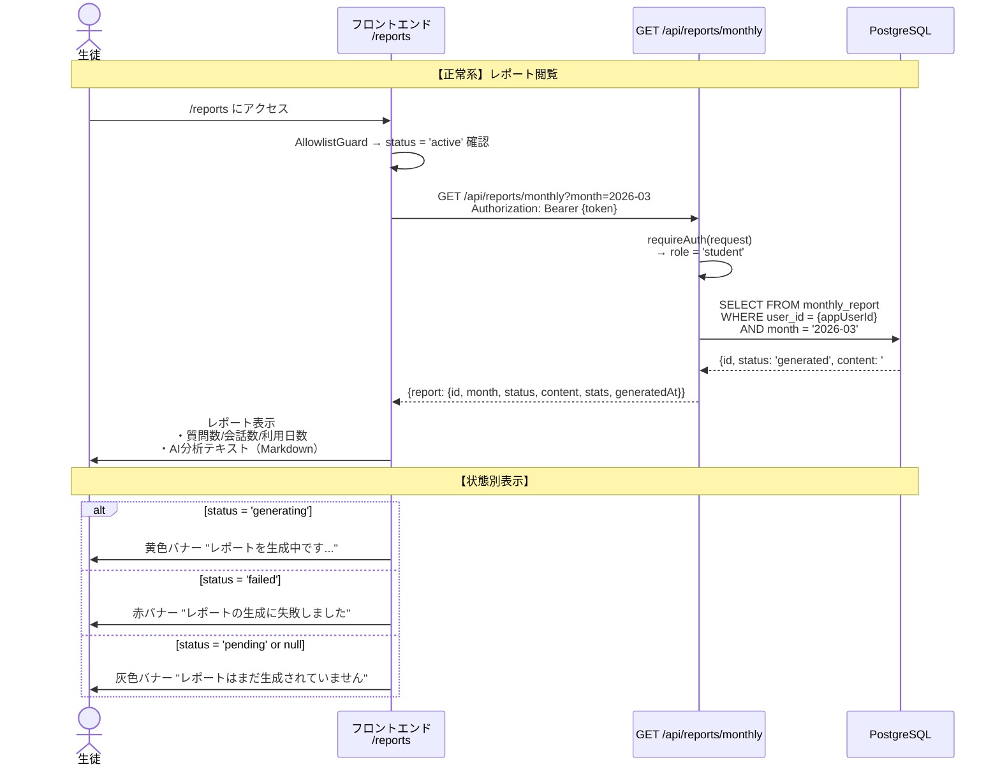

---

## 9. 会話検索フロー（スタッフ操作）

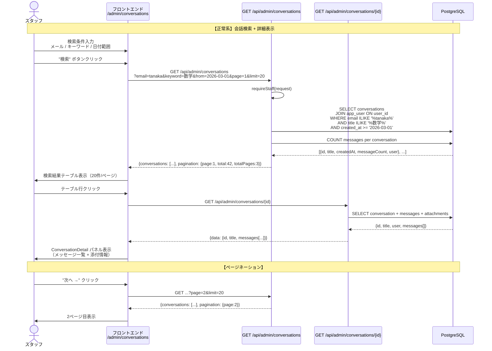

---

## 10. CSV ダウンロードフロー

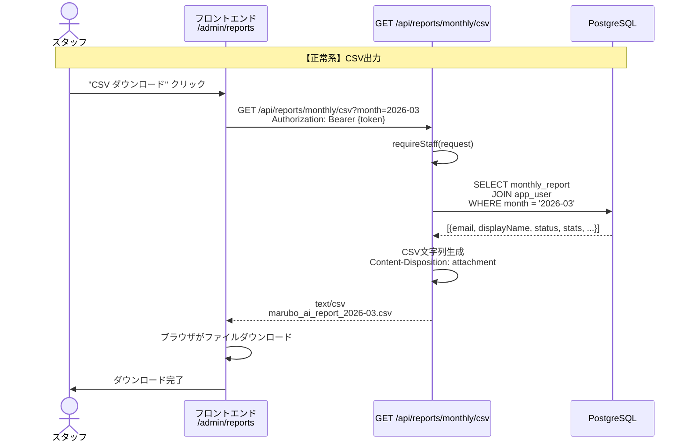

---

## 補足: 共通エラーハンドリングパターン

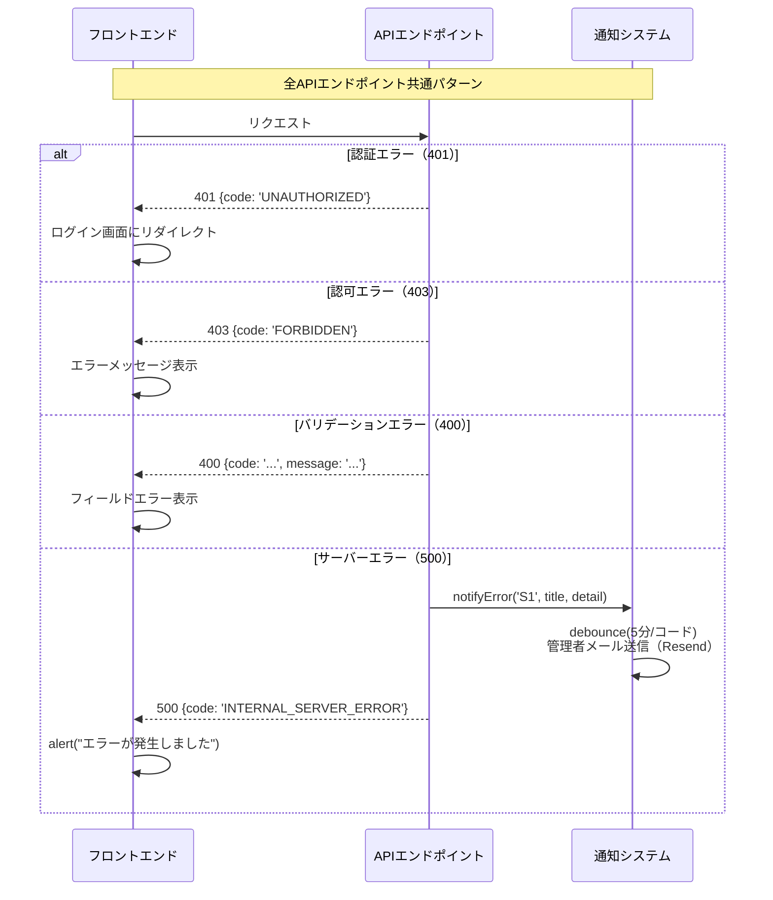
