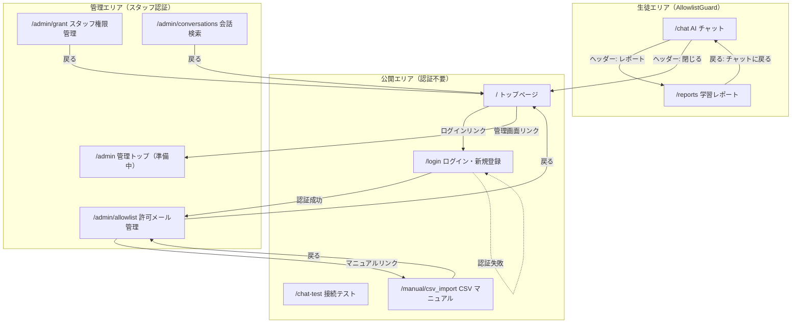
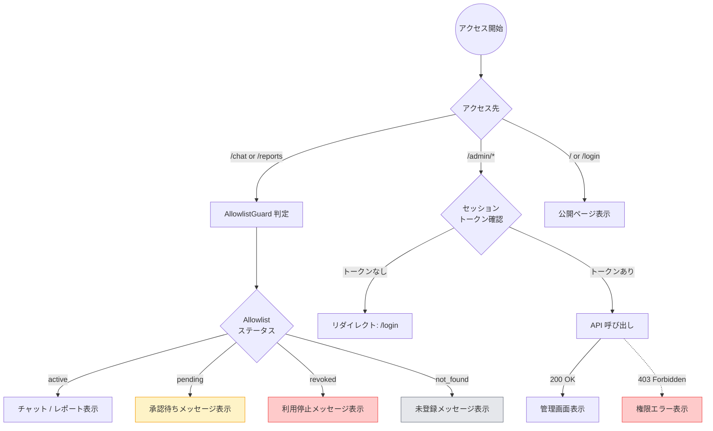
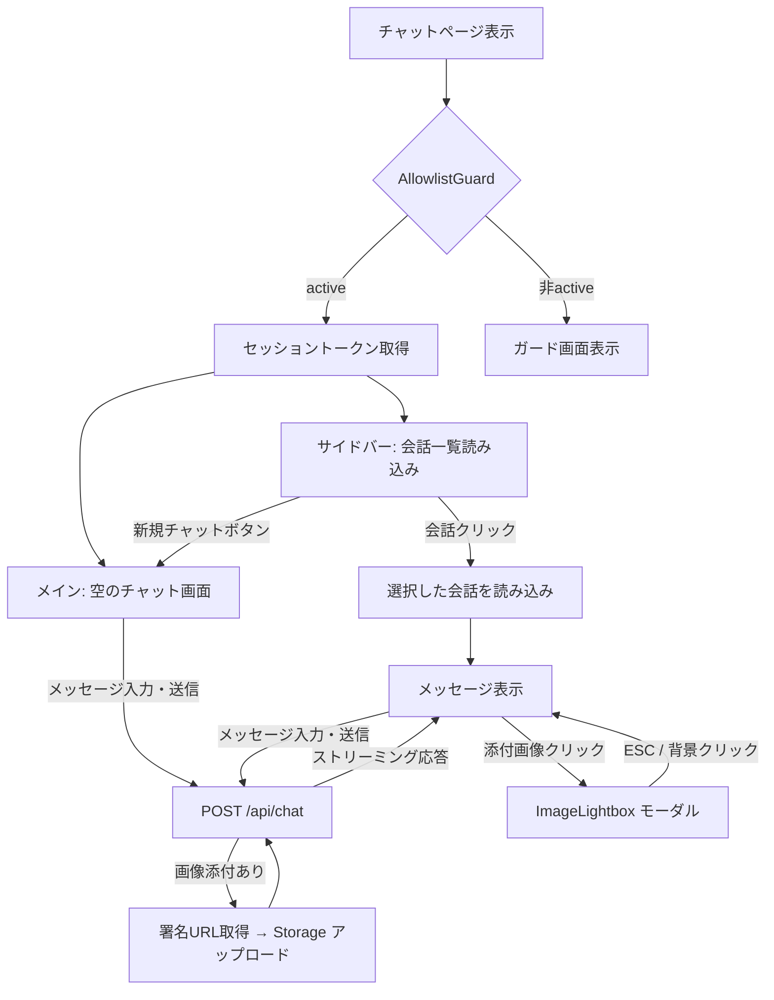
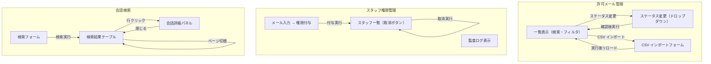
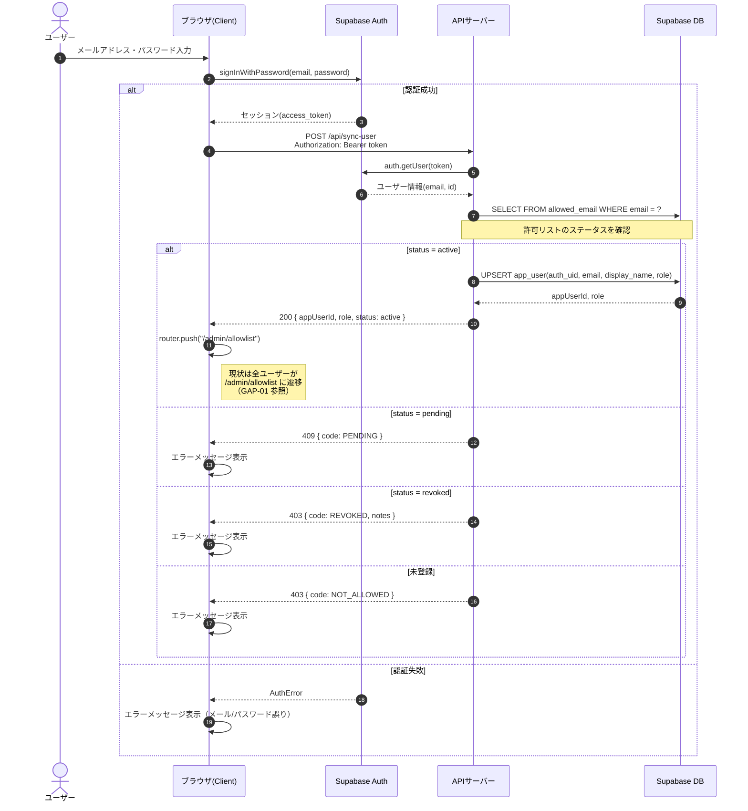
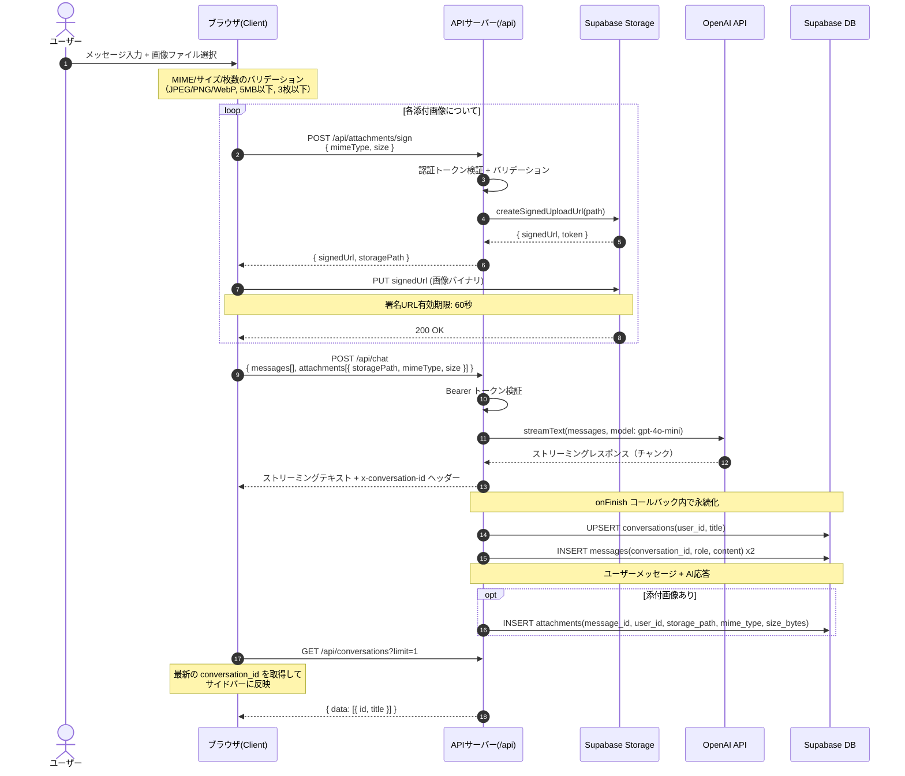
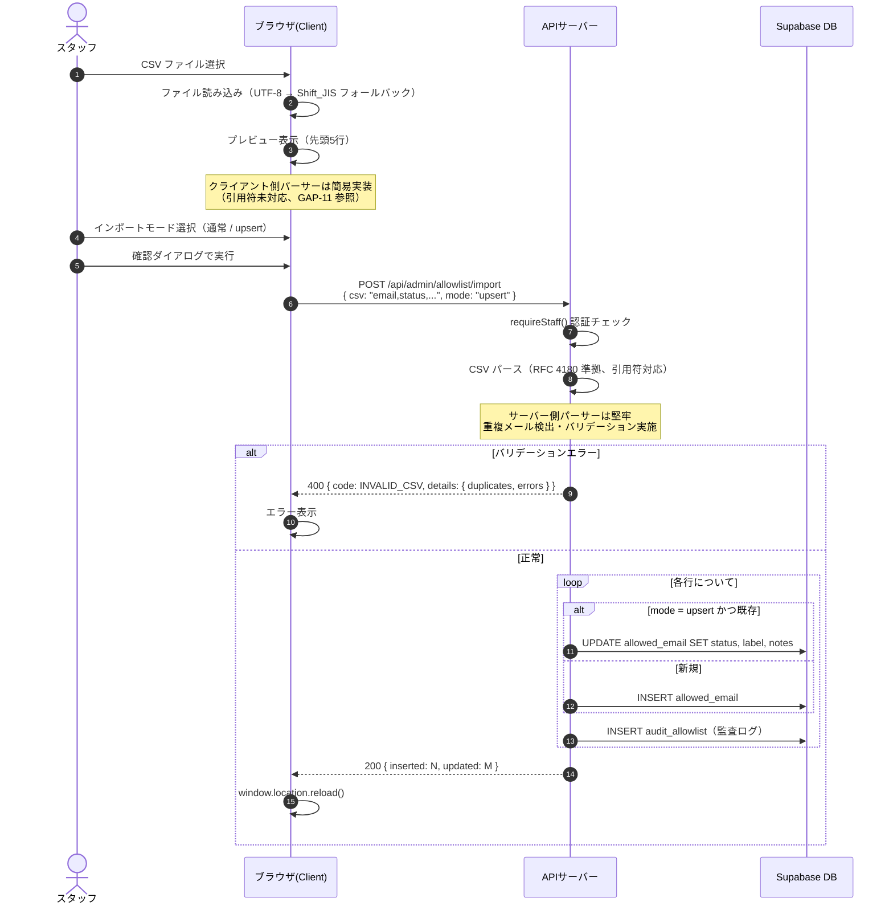
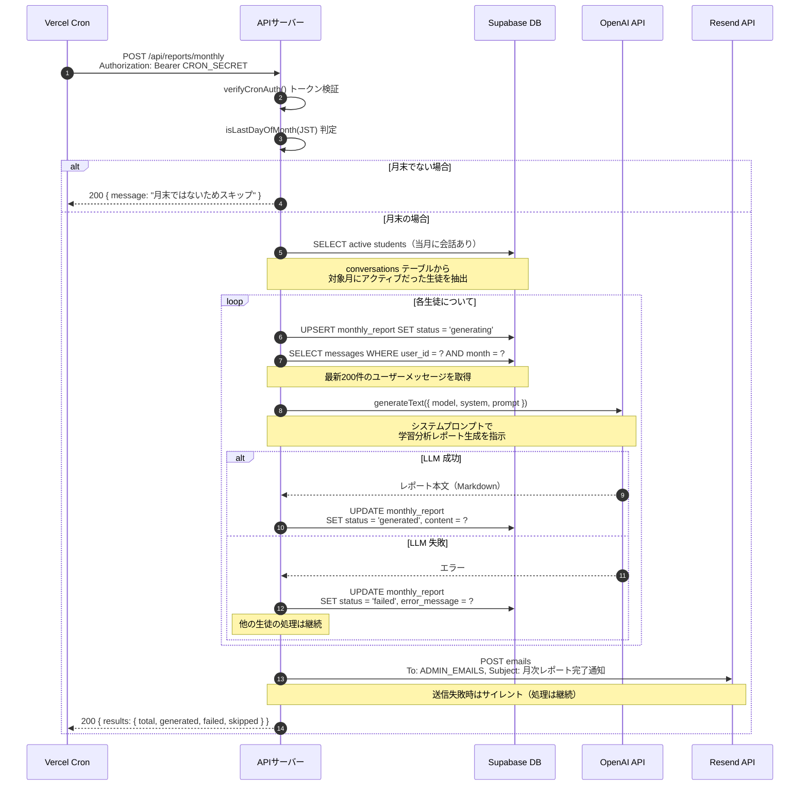
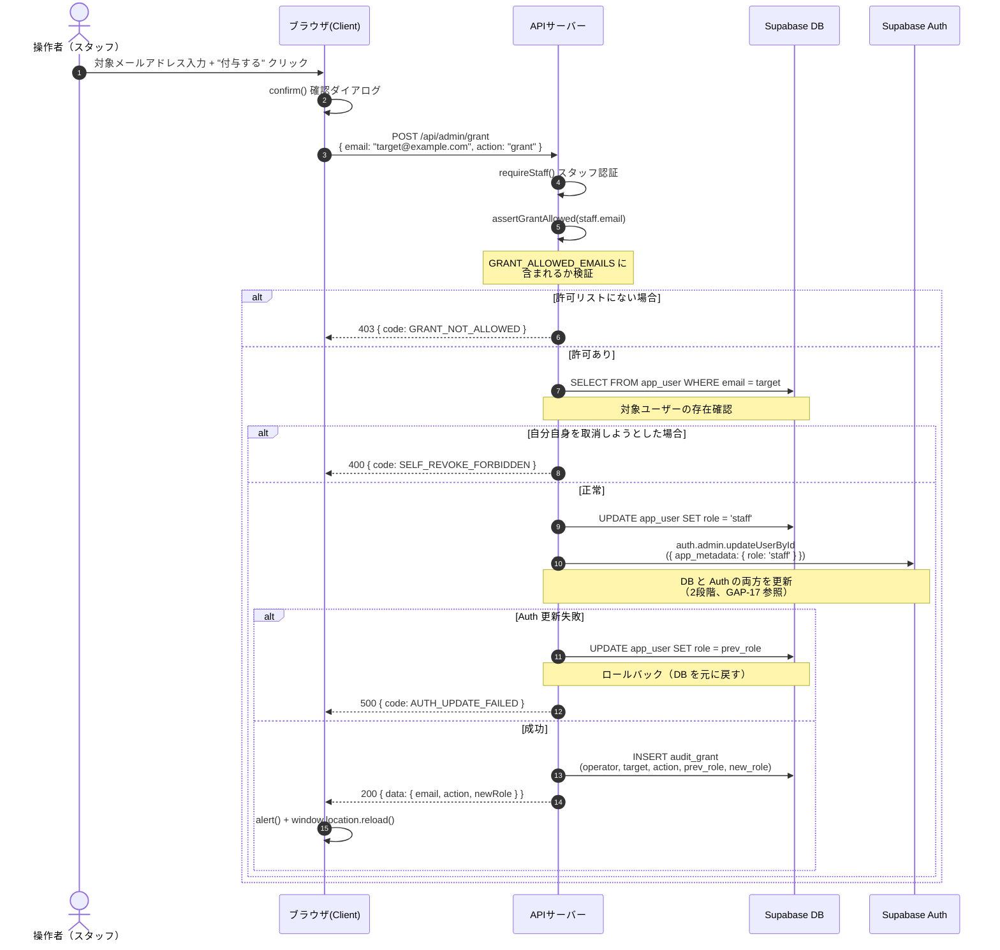

# Marubo AI システムアーキテクチャ分析

本書は、Marubo AI（塾向け AI チャットボット）の現行実装を分析し、画面遷移図・シーケンス図・未決定事項の洗い出し・将来展望をまとめたものである。

---

## 目次

1. [画面遷移図（Screen Transitions）](#1-画面遷移図screen-transitions)
2. [主要機能のシーケンス図（Sequence Diagrams）](#2-主要機能のシーケンス図sequence-diagrams)
3. [未決定事項の洗い出しと改善提案（Gap Analysis）](#3-未決定事項の洗い出しと改善提案gap-analysis--proposals)
4. [将来のアーキテクチャ展望](#4-将来のアーキテクチャ展望)

---

## 1. 画面遷移図（Screen Transitions）

### 1.1 全体画面遷移マップ



### 1.2 認証・アクセス制御フロー

ユーザーの認証状態・許可リストステータス・ロールに応じた画面遷移の分岐を示す。



### 1.3 チャットエリア内部遷移



### 1.4 管理エリア内部遷移



---

## 2. 主要機能のシーケンス図（Sequence Diagrams）

### 2.1 ユーザー認証・初回ログインフロー



### 2.2 AI チャットメッセージ送信フロー（画像添付あり）



### 2.3 許可リスト CSV 一括インポートフロー



### 2.4 月次レポート自動生成フロー（Cron）



### 2.5 スタッフ権限付与・取消フロー



---

## 3. 未決定事項の洗い出しと改善提案（Gap Analysis & Proposals）

### UI/UX の空白

| ID | 指摘箇所・機能 | 現在の実装状況（課題） | システムへの影響 | 最適な改善提案（具体的に） | 優先度 |
|---|---|---|---|---|---|
| GAP-01 | ログイン後のリダイレクト先 | `handleLogin` 成功時に全ユーザーが `/admin/allowlist` にリダイレクトされる。生徒がアクセスすると API が 403 を返しエラー表示になる | 生徒の UX が著しく悪い。初回ログイン時に何もできない画面に遷移する | `/api/sync-user` のレスポンスに含まれる `role` を参照し、`student` なら `/chat`、`staff` なら `/admin/allowlist` に分岐リダイレクトする。`login/page.tsx` の `handleLogin` 内で分岐を追加 | 高 |
| GAP-02 | 管理画面のナビゲーション | `/admin/allowlist`、`/admin/grant`、`/admin/conversations` 間の横断ナビゲーションがない。各ページは `/`（トップ）への「戻る」リンクのみ | スタッフが管理機能間を移動するたびにトップページを経由する必要がある | `AdminLayout` コンポーネントを作成し、サイドバーまたはタブナビゲーションで3つの管理ページを横断できるようにする。`app/admin/layout.tsx` にナビゲーションバーを実装 | 高 |
| GAP-03 | ローディング表示 | 全ページでスピナー + テキスト（「読み込み中...」）のみ。スケルトンローダーやプレースホルダーがない | 初回ロード時に画面が一瞬空白になり、CLS（Cumulative Layout Shift）が発生する | テーブル表示箇所（allowlist、conversations）に Skeleton コンポーネント（行数分の灰色バー）を追加。`app/admin/allowlist/page.tsx` の `loading` 状態時にスケルトンを描画。Next.js の `loading.tsx` ファイルも併用 | 中 |
| GAP-04 | Empty State（0件表示） | `ConversationSidebar` に「履歴はありません」の表示はあるが、管理画面の検索結果0件時・レポート未生成時に専用の Empty State がない | ユーザーが「データがない」のか「エラーで表示されない」のか区別できない | 各一覧コンポーネントに `EmptyState` コンポーネント（イラスト + 説明文 + アクションボタン）を追加。例: 会話検索0件時に「条件に一致する会話が見つかりません。検索条件を変更してください。」と表示 | 中 |
| GAP-05 | エラーバウンダリ | React Error Boundary が実装されていない。コンポーネント内のランタイムエラーでページ全体が白画面になる | ユーザーにとって回復不能な状態になる。特にチャット中のクラッシュは致命的 | `src/shared/components/ErrorBoundary.tsx` を作成し、`app/layout.tsx` および `app/chat/layout.tsx` に配置。エラー時に「問題が発生しました。ページを再読み込みしてください。」と表示し、再読み込みボタンを提供 | 高 |
| GAP-06 | サイドバー自動更新 | 新規メッセージ送信後、`ConversationSidebar` が自動更新されない。`sidebarKey` の更新でリマウントするが、API からの最新会話が反映されるまでラグがある | 新しい会話を開始しても、サイドバーに即座に反映されない | `ChatInterface` の `onNewConversation` コールバックで `sidebarKey` をインクリメントする現行方式に加え、`ConversationSidebar` 側で楽観的更新（仮の会話エントリを先頭に追加）を実装 | 低 |
| GAP-07 | サポート連絡先ハードコード | `AccountStatusBanner.tsx` のサポートメールが `support@example.com` にハードコードされている | 実際の問い合わせ先と異なるメールアドレスが表示される | 環境変数 `NEXT_PUBLIC_SUPPORT_EMAIL` を追加し、`AccountStatusBanner` から参照する。`.env.example` にも追記 | 高 |

### エッジケースと異常系

| ID | 指摘箇所・機能 | 現在の実装状況（課題） | システムへの影響 | 最適な改善提案（具体的に） | 優先度 |
|---|---|---|---|---|---|
| GAP-08 | API リトライロジック | 全ての API 呼び出しでリトライ機構がない。ネットワーク一時障害やタイムアウトで即座にエラー表示になる | 一時的な接続障害でもユーザーに永続的なエラーが表示される | `src/shared/lib/fetchWithRetry.ts` を作成。指数バックオフ（1s → 2s → 4s、最大3回）で 5xx / ネットワークエラーをリトライ。4xx は即座にエラー返却。各 hooks の fetch 呼び出しをラップ | 中 |
| GAP-09 | 画像アップロード中のアンマウント | `useImageAttachments` フックでアップロード中にコンポーネントがアンマウントされた場合、`setState` が呼ばれる可能性がある。プレビュー URL の `revokeObjectURL` も未実行になる | メモリリーク。React の「unmounted component への setState」警告 | `useEffect` の cleanup 関数で `AbortController.abort()` を実行し、進行中の fetch をキャンセル。`mounted` ref を使って `setState` を抑制。cleanup 時に全プレビュー URL を `revokeObjectURL` | 中 |
| GAP-10 | 添付画像の署名 URL 失敗 | `MessageBubble` の `AttachmentThumbnails` で `createSignedUrl` が失敗した場合、サイレントに画像をスキップする。エラーメッセージもリトライもない | ユーザーには画像が「存在しない」ように見える。Storage ポリシー未設定時に原因が分からない | 署名 URL 取得失敗時にプレースホルダー画像（壊れた画像アイコン + 「画像を読み込めませんでした」）を表示。1回のリトライ（5秒後）を実装。3回連続失敗でエラー表示を確定 | 中 |
| GAP-11 | CSV パーサーの不整合 | クライアント側 `CsvImportForm` のパーサーが単純なカンマ分割（引用符未対応）。サーバー側は RFC 4180 準拠で引用符・エスケープ対応 | プレビュー表示とサーバー処理で結果が異なる場合がある（引用符を含むフィールド） | クライアント側パーサーをサーバーと同等の RFC 4180 準拠パーサーに置き換え。`src/shared/lib/csvParser.ts` として共通化し、クライアント・サーバー双方から使用 | 低 |
| GAP-12 | 監査ログのページネーション | `GET /api/admin/grant` が全監査ログを一括返却する。ページネーションがない | データ量の増加に伴いレスポンスサイズが肥大化し、ブラウザのメモリを圧迫する | `auditLog` にも `page`/`limit` パラメータを追加。`listGrantInfo()` 内で `range()` を使ってページネーション実装。フロント側にも「もっと読む」ボタンを追加 | 低 |
| GAP-13 | N+1 クエリ | `GET /api/conversations/[id]` がメッセージ取得後、各メッセージの添付を個別クエリで取得している | メッセージ数が多い会話で DB へのクエリ回数が増大し、レスポンスが遅延する | 添付取得を1回の `SELECT * FROM attachments WHERE message_id IN (...)` に統合。取得後に JavaScript 側で `message_id` をキーにグルーピング | 中 |

### セキュリティと権限

| ID | 指摘箇所・機能 | 現在の実装状況（課題） | システムへの影響 | 最適な改善提案（具体的に） | 優先度 |
|---|---|---|---|---|---|
| GAP-14 | Next.js Middleware 未使用 | ルート保護がクライアント側のみ（`useEffect` でトークン確認 → `/login` リダイレクト）。サーバーサイドの Middleware がない | 直リンクで `/admin/*` にアクセスした場合、一瞬ページが表示されてからリダイレクトが発生する（フラッシュ） | `middleware.ts` を作成し、`/admin/*`、`/chat`、`/reports` パスで Supabase セッションを検証。未認証時はサーバーサイドで `/login` にリダイレクト。`@supabase/ssr` の `createServerClient` を使用 | 高 |
| GAP-15 | スタッフ会話アクセスの監査 | スタッフが生徒の会話を閲覧しても監査ログが記録されない。Grant 操作と Allowlist 操作には監査ログがある | 生徒のプライバシーに関わる操作の追跡ができない。個人情報保護の観点で問題 | `audit_admin_access` テーブルを新設。`GET /api/admin/conversations/[id]` でスタッフが会話詳細を閲覧した際に、`{ staff_user_id, conversation_id, accessed_at }` を記録 | 高 |
| GAP-16 | レート制限 | 全 API エンドポイントにレート制限がない。特にレポート生成（LLM 呼び出し）とCSV インポートが無制限 | 悪意ある連続リクエストや操作ミスで OpenAI API コストが急増する。CSV インポートで大量データの一括投入も可能 | Vercel Edge Middleware + Upstash Redis でトークンバケット方式のレート制限を実装。設定例: 一般 API は 60 req/min、レポート生成は 5 req/hour、CSV インポートは 10 req/hour | 中 |
| GAP-17 | スタッフ権限の粒度 | `staff` ロールが単一で、全管理機能（allowlist・grant・conversations・reports）に一律アクセス可能 | 権限の分離ができない。全スタッフが全生徒の会話を閲覧でき、最小権限の原則に反する | 将来的に `app_metadata.permissions: string[]` を導入し、`['allowlist', 'grant', 'conversations', 'reports']` のような粒度で制御。β版では現行のまま許容し、ユーザー数増加時に実装 | 低 |
| GAP-18 | エラーメッセージによるメール列挙 | Grant API で `USER_NOT_FOUND`、`ALREADY_STAFF` 等のエラーコードがユーザーの存在を暴露する | 攻撃者がメールアドレスの有無をブルートフォースで確認できる | エラーメッセージを一般化。例: `USER_NOT_FOUND` → `GRANT_FAILED`（「操作を完了できませんでした」）。詳細はサーバーログにのみ記録 | 中 |
| GAP-19 | Grant の2段階更新 | `app_user.role` と `auth.users.app_metadata.role` を別々に更新。途中失敗でロールバックロジックはあるが、ロールバック自体が失敗する可能性 | DB とAuth のロール状態が不整合になり、ユーザーの権限が正しく動作しない | Supabase の Database Function（`plpgsql`）で `app_user.role` 更新と `auth.admin.updateUserById` をトランザクション内で実行。失敗時の整合性チェック用 Cron ジョブも検討 | 中 |
| GAP-20 | Cron シークレットの管理 | `CRON_SECRET` が平文の環境変数。Vercel の暗号化はされるが、ログ出力やデバッグ時に露出するリスク | 漏洩時に第三者がレポート生成を任意に実行でき、LLM コストが発生する | Vercel の `CRON_SECRET` 自動検証（`x-vercel-cron-secret` ヘッダー）を活用。カスタム Bearer トークンではなく、Vercel プラットフォームの組み込み認証を使用 | 中 |

### ビジネスロジックの矛盾

| ID | 指摘箇所・機能 | 現在の実装状況（課題） | システムへの影響 | 最適な改善提案（具体的に） | 優先度 |
|---|---|---|---|---|---|
| GAP-21 | 管理画面での画像プレビュー | `/admin/conversations` の会話詳細で添付画像はメタデータ（ファイル種別・サイズ）のみ表示。画像プレビューがない | スタッフが生徒の添付画像を確認するために別のツールが必要になる | `ConversationDetail` コンポーネント内の添付表示部分で、Service Role の署名 URL を用いてサムネイルを描画。既存の `AttachmentThumbnails` コンポーネントのロジックを流用 | 中 |
| GAP-22 | 会話のメッセージ本文検索 | `/admin/conversations` の `keyword` パラメータが会話タイトルのみを検索対象にしている。メッセージ本文は検索不可 | スタッフが特定の質問内容を探すのに時間がかかる | `adminConversations.ts` の `listConversations` に `messages` テーブルの `content` を `ilike` で検索する条件を追加。パフォーマンス対策として PostgreSQL の `pg_trgm` 拡張 + GIN インデックスの導入を検討 | 低 |
| GAP-23 | レポート生成のコスト制御 | スタッフが手動でレポート生成を無制限に実行可能。`dryRun` フラグはあるが、本実行の回数制限がない | 操作ミスや誤解で同一月のレポートを何度も再生成し、OpenAI API コストが急増する | `monthly_report` テーブルに `generation_count` カラムを追加し、同一ユーザー・同一月で3回以上の再生成時に確認を要求。API 側で `generation_count >= 3` の場合に `force: true` パラメータを必須にする | 中 |
| GAP-24 | 会話の削除・編集機能 | 生徒が自分の会話を削除・編集する機能がない。タイトルの変更も不可 | GDPR/個人情報保護の観点で、ユーザーが自分のデータを削除できないのは問題になり得る | `DELETE /api/conversations/[id]` エンドポイントを追加。RLS で本人のみ削除可能に制限。UI にはサイドバーの会話項目にスワイプ削除または右クリックメニューを追加 | 低 |
| GAP-25 | クライアント側フォームバリデーション | 管理画面のフォーム（Grant のメール入力、Allowlist の新規作成等）でクライアント側バリデーションがない。サーバー側でのみ検証 | ユーザーが送信ボタンを押すたびにサーバーリクエストが発生し、バリデーションエラーのフィードバックが遅い | メール形式の正規表現チェック、必須フィールドの空欄チェック、文字数制限を各フォームの `onChange`/`onBlur` で実装。`src/shared/lib/validation.ts` に共通バリデーション関数を配置 | 低 |

---

## 4. 将来のアーキテクチャ展望

### 4.1 改善提案の実装効果

上記 GAP の対応を3段階に分けて実施した場合の期待効果を示す。

#### Phase 1: 即時対応（1-2週間）— UX クリティカル

| 対象 | 実装内容 | 期待効果 |
|------|----------|----------|
| GAP-01 | ログイン後のロール別リダイレクト | 生徒の初回体験が劇的に改善 |
| GAP-02 | 管理画面ナビゲーション | スタッフの業務効率が向上 |
| GAP-05 | Error Boundary | 予期せぬクラッシュからの回復が可能に |
| GAP-07 | サポートメール環境変数化 | 正しい問い合わせ先が表示される |
| GAP-14 | Next.js Middleware | 認証フラッシュの解消、セキュリティ向上 |

#### Phase 2: 短期対応（2-4週間）— セキュリティ・信頼性

| 対象 | 実装内容 | 期待効果 |
|------|----------|----------|
| GAP-08 | API リトライロジック | 一時的障害でのエラー率低減 |
| GAP-10 | 画像表示のフォールバック | 画像関連の UX 改善 |
| GAP-13 | N+1 クエリ解消 | 会話詳細の応答速度改善 |
| GAP-15 | 会話アクセス監査 | プライバシー保護の証跡確保 |
| GAP-16 | レート制限 | 不正利用・コスト急増の防止 |
| GAP-18 | エラーメッセージ一般化 | メール列挙攻撃の防止 |
| GAP-19 | Grant の整合性強化 | ロール状態の不整合リスク低減 |
| GAP-23 | レポート生成コスト制御 | LLM API コストの予測可能性向上 |

#### Phase 3: 中期対応（1-2ヶ月）— 拡張性・運用

| 対象 | 実装内容 | 期待効果 |
|------|----------|----------|
| GAP-03 | スケルトンローダー | 体感速度の向上、CLS 改善 |
| GAP-04 | Empty State | ユーザー体験の一貫性向上 |
| GAP-17 | 権限の粒度追加 | 最小権限の原則を実現 |
| GAP-21 | 管理画面の画像プレビュー | スタッフの確認業務効率化 |
| GAP-22 | メッセージ本文検索 | コンテンツ検索能力の向上 |
| GAP-24 | 会話削除機能 | データ主権の確保 |

### 4.2 アーキテクチャの進化方向

現行アーキテクチャはβ版（約20名）の規模に適した設計であり、以下の方向で段階的に進化させることを推奨する。

#### データベーススキーマの拡張

```
現行（β版）                    将来（本番スケール）
─────────────                ──────────────────
app_user                     app_user
  + role: text                 + role: text
                               + permissions: jsonb     ← 粒度の細かい権限
                               + last_active_at: timestamptz

conversations                conversations
  + user_id                    + user_id
  + title                      + title
                               + is_archived: boolean   ← アーカイブ機能
                               + deleted_at: timestamptz ← 論理削除

monthly_report               monthly_report
  + generation_count: int      + generation_count       ← 再生成回数制御

（新規）                      audit_admin_access        ← スタッフ操作監査
                               + staff_user_id
                               + resource_type
                               + resource_id
                               + accessed_at
```

#### 外部連携の拡張ポイント

| 領域 | 現行 | 将来の拡張 |
|------|------|-----------|
| LLM | OpenAI (gpt-4o-mini) 単一 | マルチモデル対応（Claude, Gemini）。レポート生成に推論特化モデル使用 |
| 通知 | Resend（メールのみ） | LINE / Slack 通知。保護者向けレポート自動送信 |
| 認証 | Supabase Auth（メール/パスワード） | Google / LINE ソーシャルログイン。保護者アカウントの追加 |
| 分析 | 月次レポート（LLM 生成） | リアルタイムダッシュボード。学習進捗トレンド。教科別分析 |
| ストレージ | Supabase Storage | CDN 経由のサムネイル配信。画像のリサイズ・最適化パイプライン |

#### パフォーマンス・スケーラビリティ

β版からのユーザー数増加に備え、以下の対策を段階的に導入する。

1. **キャッシュ層の追加**: Vercel Edge Cache / Upstash Redis でリスト API のレスポンスをキャッシュ。TTL は 30秒〜5分
2. **全文検索の導入**: PostgreSQL `pg_trgm` + GIN インデックス → 将来的に Meilisearch / Algolia 外部検索エンジン
3. **バックグラウンドジョブ**: レポート生成を Vercel Cron から Inngest / Trigger.dev に移行し、リトライ・並列実行・進捗追跡を実現
4. **監視・アラート**: Sentry（エラートラッキング）+ Vercel Analytics（パフォーマンス）+ Supabase Logs（DB スロークエリ）の3層監視

### 4.3 総括

Marubo AI の現行アーキテクチャは、Next.js App Router + Supabase + Vercel AI SDK という現代的なスタックで構築されており、β版の規模においては十分に機能している。特に以下の点は高く評価できる。

- **認証・認可の多層防御**: Supabase Auth → Bearer トークン → RLS ポリシーの3層で保護
- **監査ログの充実**: Grant/Allowlist 操作に対する追跡性の確保
- **ストリーミング AI レスポンス**: Vercel AI SDK v6 による低遅延チャット体験
- **画像添付の署名 URL 方式**: セキュアなアップロード・表示フロー

一方で、本番運用に向けては上記 25件の GAP に示した通り、UX の研磨（ログイン後遷移、Error Boundary、スケルトン）、セキュリティ強化（Middleware、レート制限、監査拡充）、および運用耐性（リトライ、コスト制御、N+1 解消）の3軸で改善を進めることを推奨する。

Phase 1（即時対応）の5項目は、いずれも数時間〜1日で実装可能であり、ユーザー体験への影響が大きいため、最優先で着手すべきである。

---

*本書は 2026-03-02 時点のソースコード分析に基づく。*
